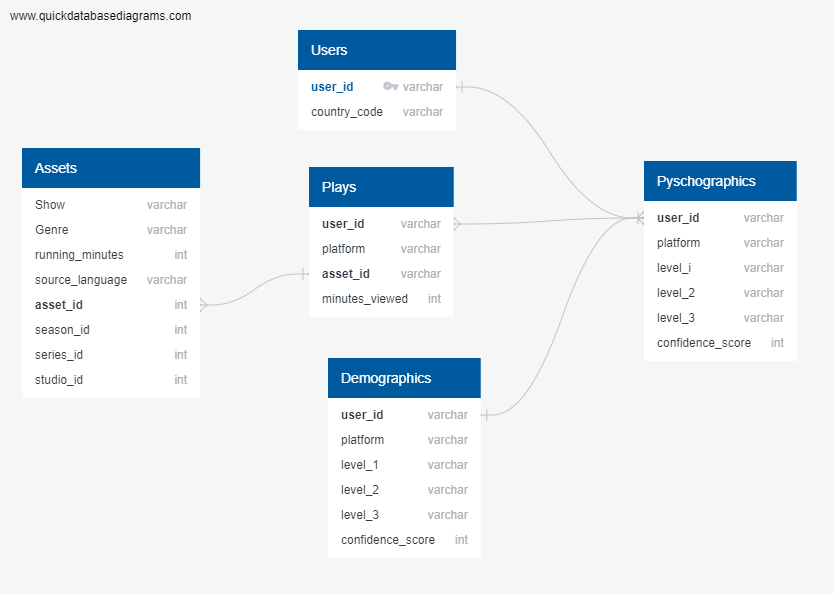

# Iflix Data Analysis Project
Selected Topic: An Investigation of Trends in Streaming Service (Iflix) Users

## Why are we interested in this topic? Why is this relevant?
With the global boom in popularity of streaming services such as Netflix and Disney+, rich consumer data can now be mined from these digital platforms to inform companies of what entertainment trends are on the rise. For the smaller company, Iflix, we are interested in dissecting its data to investigate what kind of user prefers what form of entertainment, to allow for a more tailored user experience. As such, we will take the gathered consumer data and use machine learning methods to build a model that can accurately predict preferences based on factors such as income, gender, and country code, just to name a few. Ultimately, results of this project can allow us to advise Iflix how to do targeted marketing to a specific audience.

## Team Description
Sharon Ng (__Square__: Repository Maintenance; Pandas Data Cleaning)  
Sereymony Srey (__Triangle__: Machine Learning Model) 
Melissa Logan (__Circle__: Database) 
Victoria Drozdowsky (__X__: Technologies Manager; Data Visualization/Tableau)

### Team Communication Protocol
- Primary mode of conversation will happen on a __Slack__ chat.
- Storage of code and general progress of project will happen on __Github__, specifically this repository.
- Planning and write-up will happen on a shared __Google__ drive among the team. 
- Virtual meeting times will occur during class (T & Th 7-9pm) and after class, with length of time as needed.

## Data Source
__"Movie streaming datasets iflix" - Found on Kaggle, posted by user Aung Pyae.__ 
_The datasets were created for the iflix datathon challenge in 2019._ 
https://www.kaggle.com/aungpyaeap/movie-streaming-datasets-iflix

The dataset contains the following sheets:
1. __assets.csv__: describes runtime of content, type of content, and genre.
2. __demographics.csv__: describes demographic data related to platform of consumption (Android or iOS), income, and gender.
3. __plays.csv__: describes the total number of minutes viewed for a particular content title.
4. __psychographics.csv__: describes whether user identifies as "Movie Lover" or "TV Lover", and further into subgroups such as "English Movies Fans" and "Korean TV Fans".
5. __users.csv__: describes what country code the user is from.

Samples Excel sheets (csv) of the data are present in the respository. 

## Data Cleaning (Sharon)
We intend on using Pandas and Jupyter Notebook to clean our dataset prior to use. Notably, we plan to:
- Eliminate duplicate demographic data within each user_id.
- Have demographic data for the same user_id to be in the same row.

## Database (Melissa)
Tables and database will be created in Postgres SQL.
Our ERD shows the flow of information from one table to another, as captured in the image below. Psychographics table will join Users, Plays and Demographics on user_id. Plays will connect to Assets on asset_id. 

## Machine Learning Model (Sereymony)
Proposed Method: Supervised learning, multiple-variable linear regression model (will be using random forest as well to see which model predicts better)  
Our Accuracy Confidence Range Goal: 80-90%  
Platform Used: Google Colab (which will be linked to Postgres). 

Dependencies: The dependencies used within code will be: pandas, numpy, matplotlib.pyplot, sklearn (linear_model), sklearn.preprocessing (LabelEncoder), sqlalchemy 

Explanation for dependencies: 

- pandas: used to create & view dataframes within code
- numpy: used to calculate numerical values of outputs
- matplotlib: used for heatmaps & plotting
- sklearn: used for preprocessing the data as well as for linear regression code
- sqlachemy: used for database stored in PostgresSQL 

X variables: gender, income level, age, country code, platform
Y variable: minutes_viewed 

Description of preliminary data preprocessing: Original data was gathered from Kaggle as multiple CSV files. Files were then cleaned using pyhton on jupyter notebook. After data was cleaned, data was taken to PostgresSQL to join tables into a single dataframe. 

Description of preliminary feature engineering and preliminary feature selection, including the decision-making process: The decision making process pertaining to the preliminary feature engineering was to figure out which variables held enough significance for the machine learning model to predict the total minutes viewed for each individual. Originally, the dataframe had limited variables integrated, however, after analysis of the code - we learned that additional columns/variables were to be added. The final decision for variables to be integrated into the dataframe is as follows: "gender, income_level, age, minutes_viewed, country_code, platform, characteristics".

All of the variables listed above were joined into a single dataframe that was used for the machine learning code. Applications used for doing so were PostgresSQL from AWS to build the database as well as join the code. 

Description of how data was split into training and testing sets: training data was split by dropping the "minutes_viewed" column as well as the "user_id" column to properly test the data. We did this to ensure that the values listed in the "user_id" & "minutes_viewed" columns were not integrated into the model and scaled with the rest of the variables. 

Explanation of model choice, including limitations and benefits: The model we decided to use was linear regression. We tried out 2 different models being linear regression as well as random forrest. What we found from the ML outputs vs. the actual is that the linear regression model better predicts the minutes viewed output vs. the random forrest model. This can be found in the google collab file committed to the main branch.

The limitations that we came across when running the data through the model was that with fewer variables, the correlation was at a negative number. In order to combat this issue, we added more variables into play in order to increase the correlation of the variables of the model. When more variables were integrated, we found that the output is much closer to the actual. There are outliers in the original data, thus when viewing the graph, you will see the outliers placed further from the regression line. 

# Update on Machine Learning Code
 
Accuracy score: When running the code - we found it to be only about 5% accurate. When examining the variables - we noticed major outliers with some of the folks specifically utilizing androids & iOS for their streaming. We decided to keep these folks inside the machine learning model in order to have a more accurate outcome of the code. This of course is a major limitation of the code - but may be very important for a potential client to know & study why these folks watch so much tv/movies. 

For future models: We think it would be very beneficial moving forward with future models to study and analyze the outliers & come to a finding what their major influecnes are when selecting a tv show and/or movie. This would be important information for marketers as it can help predetermine what types of tv shows/movies people would prefer over others. 

### Our Analysis of Machine Learning Results
Our original hypothesis was that high-income earners will have less leisure time to spend on watching tv/movies. Therefore, their total running times will be lower than those of medium-income and low-income earners. 

_Research Questions_: How long will a user spend watching Iflix given their income demographic (low, middle, or high)? How can we use the answer to the above question to tailor our marketing to Iflix users based on their income level? And other demographics?

Given our results...

## Dashboard
### Description of Tool That Will Be Used:
- Tableau Public will be used to create the final dashboard 
- Users who have access to the link will be able to view and interact within the dashboard
### Description of Interactive Element:
- Dashboard users will be able to filter data by various demographics and characteristics (i.e. Income Level)
- The dashboard will visualize the Iflix data and our findings throughout our analysis

Link to Dashboard: https://public.tableau.com/app/profile/victoria.drozdowsky/viz/AnalysisofIflixStreamingTrends/Countries?publish=yes

## Presentation
Link to Google Slides: https://docs.google.com/presentation/d/18-z4R8C5ikNKaz8lDjH3rCXX4vy3wfczbbSX1y9qB3A/edit?usp=sharing
